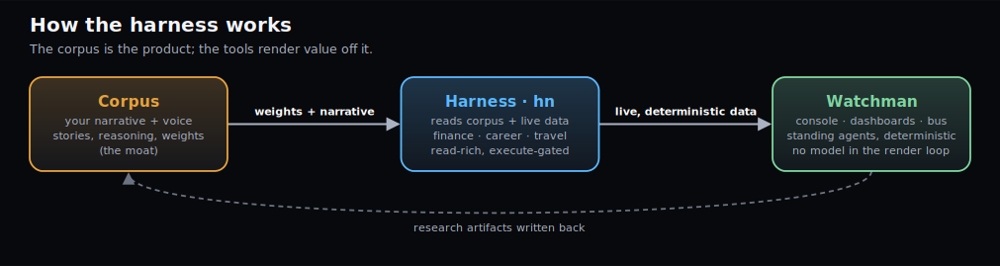
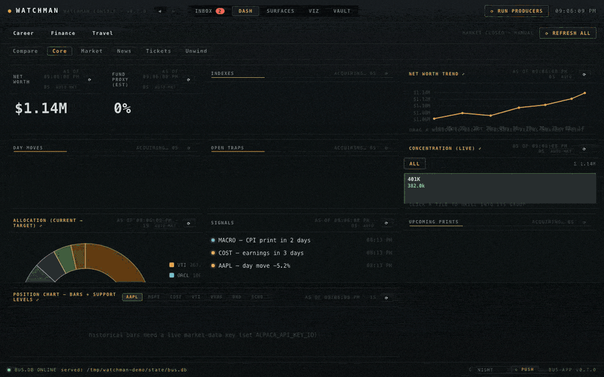
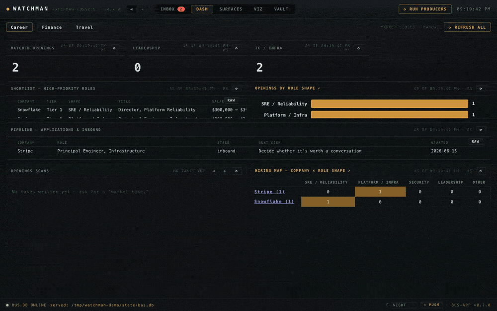
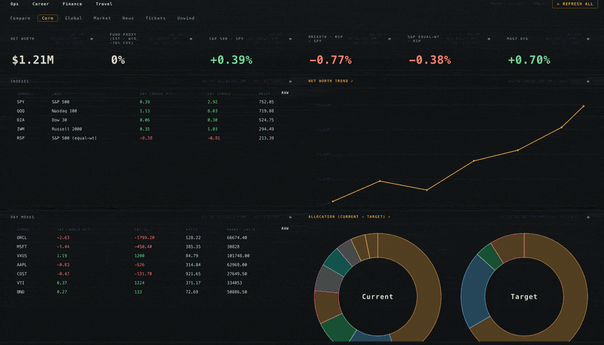
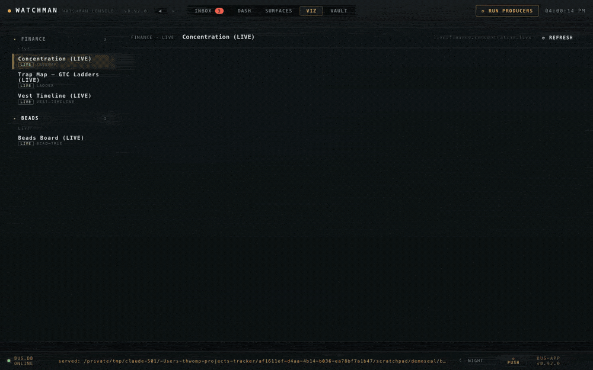
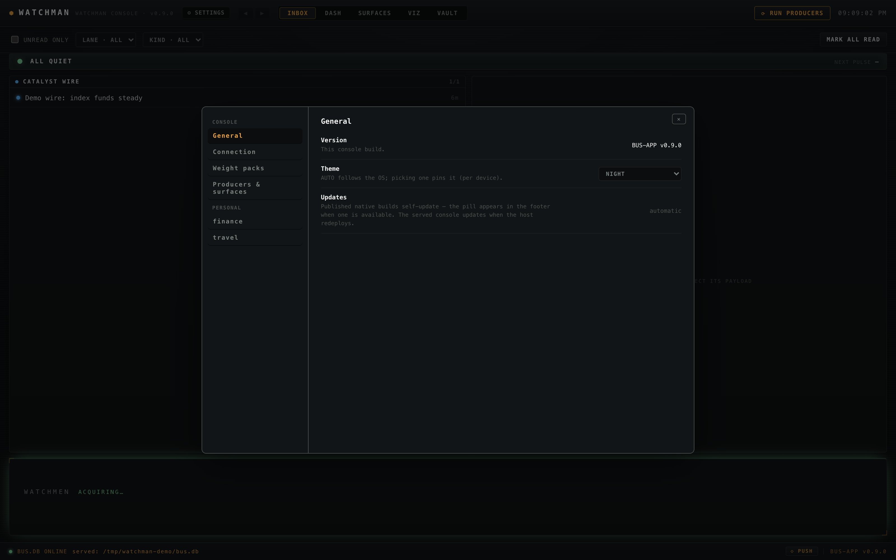
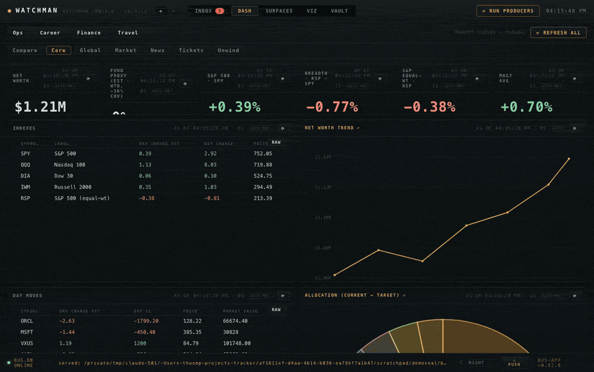

# Watchman

**A personal agentic harness — a corpus of who you are, and tools that act on live data and reason against it.**

Watchman renders live, deterministic views over your own data — finance, career, travel — through a CLI
and a resident desktop console. It's built on one thesis:

> **The corpus is the product.** Every output — a net-worth read, a role shortlist, a market take, a
> ghost-written note — is bespoke *only to the degree the corpus knows you*. The corpus is a **narrative**:
> your stories, the *why* behind your decisions, your preferences and their emotional texture, **in your own
> voice**. That voice is the moat — it's what makes the output sound like *you* instead of generic AI. The
> machine-readable weights the tools read are a thin derived projection of it. The dashboards are just a surface.

**Three layers** make it work — the diagram below traces how they connect:

- **Corpus** — *who you are.* Your stories, decisions, and preferences, in your own voice. The product;
  everything else is downstream. The tools read a thin, legible projection of it — `portfolio.yaml`,
  `watchlist.yml`, `weights.yaml` ([real examples below](#the-weight-packs)).
- **Harness** (`hn`) — *the tools.* A CLI of domain lanes — finance · career · travel — that read the corpus
  + live data and reason against it. No model in the loop.
- **Watchman** — *the console.* Dashboards + a notification bus rendering the harness's output, live and
  always-on — as a resident desktop app, or served to any browser on your own network.



> **Try the demo console** — prebuilt and self-contained (engine bundled; just install
> [uv](https://docs.astral.sh/uv/) first), loads a fictional sample persona out of the box:
> **[⬇ Windows](../../releases/latest/download/Watchman-Setup-x64.exe)** ·
> **[⬇ Linux .deb](../../releases/latest/download/watchman-amd64.deb)** ·
> [all releases](../../releases) — details in [Download the console](#download-the-console--one-prerequisite-no-toolchain).

## See it move

A weight **pack is a persona** — a complete sample profile across every lane. Loading one swaps the *whole*
console; the dashboards are just weights over the corpus.



_Finance console on a bundled sample persona — net worth and trend, the sell-planning view, the
market-take reader, and an execution ticket, all rendering **live, deterministic data** as the
widgets refresh. (Recorded headlessly against a sealed demo instance — fictional data only.)_



_The career board: shortlist, pipeline, and the company × role-shape hiring map — same persona,
same seal._



_Eleven built-in themes — three utilitarian daily drivers and a creative fleet, picked in
**⚙ Settings → General**._

**A clip for every lane — the full tour lives in [`docs/EXAMPLES.md`](docs/EXAMPLES.md).**

## What's in the box

- **`hn` CLI** — one root binary, four mountable lanes:
  - `hn finance` — read-only market data: quotes · positions · net worth · **market** (regime/breadth) ·
    fundamentals (SEC EDGAR) · multiples · **correlate** (diversification/beta vs. a factor) · news · wire
    (broad-market headlines) · research · watch · **trap-map** (your resting GTC orders as price ladders) · screen. **No trading; observation only.**
  - `hn career` — a read-only role-hunt lane: keyless openings scans (Greenhouse/Ashby) with posted comp,
    company profiles, and D3 visuals.
  - `hn travel` — live-travel research hands: flight ranking · hotels · events · traffic · ferries · weather
    /air/quake senses · destination viz.
  - `hn beads` — a read-only board over a [beads](https://github.com/gastownhall/beads) issue tracker's
    export: counts, presence, an honest ready queue, per-issue ticket pages.
- **Watchman console** — a small resident desktop app (Tauri): domain **dashboards** that self-refresh from
  the CLI's `--json` verbs, a **notification bus** for standing agents, and an interactive **viz** layer.
  No model is ever in the render loop.
- **The web console** — the same console, served: `hn bus serve --console --ui` puts it in any browser on
  your network or private mesh — including your phone, installable as a PWA. One server, one token; see
  [`docs/WEB-CONSOLE.md`](docs/WEB-CONSOLE.md).
- **A D3 viz engine** — one Python↔Node renderer shared across lanes (the diagram above is rendered by it).

## Your backlog, on the console

Tracks work with [beads](https://github.com/gastownhall/beads) (a git-native issue tracker built
for humans and AI agents sharing a backlog)? Watchman renders it first-class:

- **Ops ▸ Backlog tab** — counts, the presence board, an honest ready queue, shipped-this-week
- **Dependency graph** — epics/children as an org chart, blocking edges on hover, tile quick-looks
- **Ticket pages** — generated docs that cross-link like a linked-issues panel
- **Read-only by construction** — `bd` stays the source of truth
- Every sample persona ships a fictional backlog, so the tab demos out of the box



**Full walkthrough + screenshots: [`docs/BEADS.md`](docs/BEADS.md).**

## Quickstart — runs out of the box on bundled sample packs

No personal data required: Watchman ships **fictional sample personas** so a fresh install runs
immediately — download the console (below), and it opens on one.

### ⚙ Settings — the console's control panel



Everything about *your* Watchman is configured in one place — hit **⚙ SETTINGS** in the masthead:

- **General** — version, the 11-theme picker (AUTO follows your OS), update posture.
- **Connection** — where this console reads its bus, and the **online-bus connect flow**: paste a
  served URL + token, **Test** it live, **Connect** (the flow clears any active demo pack, which
  would otherwise silently override remote mode). **Disconnect** returns to local.
- **Weight packs** — swap the active persona or **Load…** your own pack folder; the whole console
  re-renders from it.
- **Producers & surfaces** — the roster of everything the console runs, human-readable.
- **Personal** — your `config/harness.yaml` user overlay (display names, fund identity, home
  city/airports), rendered per lane. Read-only by design: the file is the interface.

Prefer the shell? The engine runs headless too — lanes, packs, and keys from the CLI are covered
in **[`docs/CLI.md`](docs/CLI.md)**.

### Download the console — one prerequisite, no toolchain

The full demo console, prebuilt and **self-contained**: each installer carries the engine inside it
(no clone, no `npm`, no Rust). The one prerequisite is [uv](https://docs.astral.sh/uv/), which manages
the console's Python runtime — on first launch the console prepares its environment (about a minute,
one time). Download, install, pick a persona in **⚙ Settings → Weight packs** — done:

| Platform | Direct download | Notes |
|---|---|---|
| **Windows 10/11** | **`winget install thwomp-io.Watchman`** · or **[⬇ Watchman-Setup-x64.exe](../../releases/latest/download/Watchman-Setup-x64.exe)** · [.msi](../../releases/latest/download/Watchman-x64.msi) | winget install is silent + SmartScreen-free; direct downloads are unsigned — see the note below |
| **Linux (deb)** | **[⬇ watchman-amd64.deb](../../releases/latest/download/watchman-amd64.deb)** | `sudo apt install ./watchman-amd64.deb` |
| **macOS** | **[⬇ Watchman-aarch64.dmg](../../releases/latest/download/Watchman-aarch64.dmg)** (Apple Silicon) | unsigned — first open needs one Gatekeeper step (below); Intel: build from source |

**Windows install, start to finish:**

1. Install [uv](https://docs.astral.sh/uv/getting-started/installation/) (PowerShell:
   `irm https://astral.sh/uv/install.ps1 | iex`).
2. Download **[Watchman-Setup-x64.exe](../../releases/latest/download/Watchman-Setup-x64.exe)** and run it.
3. SmartScreen will warn — the installer is open-source but **unsigned** (no paid code-signing cert).
   Click **More info → Run anyway**. (Audit the source right here if you'd rather build it yourself:
   Node + Rust with the MSVC build tools rustup installs; WebView2 ships with Windows 10/11.)
4. Launch **Watchman** — it opens on a bundled **fictional sample persona**. The first launch spends
   about a minute preparing the bundled engine's Python environment; the dashboards go live as it
   completes.
5. Swap personas in **⚙ Settings → Weight packs**; the whole console re-renders.

**macOS install, start to finish:**

1. Install [uv](https://docs.astral.sh/uv/) (`curl -LsSf https://astral.sh/uv/install.sh | sh` or `brew install uv`).
2. Download **[Watchman-aarch64.dmg](../../releases/latest/download/Watchman-aarch64.dmg)**, open it, drag **Watchman** to Applications.
3. First open: **right-click the app → Open → Open** (it's open-source but **unsigned** — no Apple
   Developer cert). If macOS still blocks it: **System Settings → Privacy & Security → Open Anyway**,
   or clear the quarantine flag: `xattr -d com.apple.quarantine /Applications/Watchman.app`.
4. It opens on a bundled **fictional sample persona** (first launch preps the engine's Python
   environment, about a minute). Swap personas in **⚙ Settings → Weight packs**.

Running the engine from the shell (any platform) and building the console from source:
**[`docs/CLI.md`](docs/CLI.md)**.

> Platform notes:
> - **Standing agents** (scheduled headless runs): macOS-`launchd` today; Task Scheduler / systemd
> ports on the roadmap — Windows/Linux render a calm *standby* state until configured
> - State lives under `~/.local/state/harness` + `~/.config/harness` everywhere (yes, dot-dirs on
> Windows — one convention)

## The web console — any browser on your network

The bus server serves the **same UI** over HTTP — a laptop, a second desktop, your phone as a PWA:

```bash
cd bus-app && npm install && npm run build # build the console once
uv run hn bus serve --console --ui bus-app/dist
# → http://127.0.0.1:8787/ (the page prompts for the bearer token on first visit)
```

- **One server, one token, one bind** — the bus process serves the console; every `/api` route
  requires the bearer token (auto-generated, `0600`); binds localhost unless you point it at a
  private-network address
- **Run it always-on over a mesh/VPN** (Tailscale/Headscale) → every device you own, one URL —
  phone included (installable as a PWA)
- **Connect a satellite console in Settings, not a config file** — **⚙ Settings → Connection →
  Online bus**: paste URL + token, **Test**, **Connect** (auto-clears any demo pack that would
  silently override remote mode)
- Details — tokens, phones/PWA, variant mounts: [`docs/WEB-CONSOLE.md`](docs/WEB-CONSOLE.md)

## Run as a container

The container image carries the **engine and the web console**: the `hn` CLI, the standing agents, the
notification bus, and the served UI — one `docker run` from a console in the browser. Your corpus is
**mounted**, never baked in. *(The desktop app still ships as native platform bundles, not in the image.)*

```bash
# pull the published image (built + scanned + smoke-tested in CI, published to GHCR)
docker run --rm ghcr.io/thwomp-io/watchman --help

# run a lane against your own mounted corpus (defaults to /corpus inside the container):
docker run --rm -v "$PWD/corpus:/corpus" ghcr.io/thwomp-io/watchman finance networth

# or serve the web console from the image:
docker run -p 8787:8787 -v "$PWD/corpus:/corpus" -v watchman-home:/home/watchman \
  ghcr.io/thwomp-io/watchman bus serve --host 0.0.0.0 --console --ui /app/ui
```

- Tagged by release (`:<version>`) + a moving `:latest` — **pin the version tag** for anything durable
- Volumes, the token, standing agents from the image: [`docs/DOCKER.md`](docs/DOCKER.md)

## A pack is a persona



_The Finance Core view re-rendering under three bundled personas — same widgets, different life._

```
samples/packs/<persona>/
  pack.yaml # identity: name, title, description, lanes, default
  finance/ # narrative + machine weights (portfolio.yaml, networth-history.json)
  career/ # the role-hunt root (watchlist.yml, applications.yaml, discoveries/)
  travel/ # preferences + weights.yaml, trips/
  dashboards/ # (optional) a curated console the pack describes for itself
```

- A pack only needs subdirs for the lanes it covers
- Your **real** corpus lives **outside** this repo (`TRACKER_PATH` / `WEIGHTS_PACK`) — nothing
  personal is ever committed
- **`hn init <dir>`** scaffolds your own (dirs + template weights, non-destructive)
- The [corpus-operator skill](skills/corpus-operator/SKILL.md) teaches an AI agent to build *your*
  corpus — passively, from conversation, in your voice — and keep it current

## The weight packs

The "weights" aren't a black box — they're plain, legible config: the criteria each lane scores against.
A taste from the bundled `demo-investor` persona (fictional data):

`finance/portfolio.yaml` — holdings, a watchlist, and the thresholds that drive day-flags:

```yaml
holdings:
  - {symbol: VTI, account: taxable, shares: 900, avg_cost: 238.40, type: etf}
  - {symbol: AAPL, account: taxable, shares: 200, avg_cost: 168.25, type: stock}
watchlist:
  - {symbol: NVDA, note: "megacap semis — AI bellwether"}
pulse: # standing-watch thresholds
  day_move_pct: 5.0 # flag a holding moving more than this on the day
  index_move_pct: 1.5
```

`career/watchlist.yml` — which companies to scan + what counts as a match:

```yaml
companies:
  - {name: ExampleCo, ats: greenhouse, token: exampleco, tier: "Tier 1"}
filters:
  title_any: [backend, platform, devops]
  seniority_any: [mid, senior]
  title_none: [sales, intern]
```

`travel/weights.yaml` — home base + what makes an event worth a trip:

```yaml
conditions:
  home: "Minneapolis, MN"                # drives the conditions watch + flight ranking
events:
  centerpiece_subgenres: ["NBA", "NFL"] # leagues worth planning a trip around
```

Change a number, reload, and every dashboard reprojects. An [AI agent maintains these *for*
you](skills/corpus-operator/SKILL.md) from conversation — but they stay plain files you own and can read.

## Posture

- **Privacy by construction.** Every outbound call carries a tool-only `User-Agent` (no name/email). Your
  real corpus stays out of the repo. The finance lane reads public prices and a local file — no brokerage
  credentials, no account in the loop.
- **Demo mode is sealed.** While a bundled sample persona is active, the console renders *only* that
  pack — widgets, producers, the vault browser, everything. A lane the pack doesn't cover reads empty;
  it never falls back to a real corpus that happens to exist on the machine. (Packs you load yourself
  keep blend semantics: their lanes override, the rest reads your corpus.)
- **First launch fetches packages.** The installed console prepares the bundled engine's Python
  environment once via uv (standard package-manager traffic against the shipped lockfile — no personal
  data leaves the machine).
- **Corpus is the source of truth; live data disciplines it.** The machine-readable weights are kept in
  *manual* sync with the human-edited narrative; the prose is never parsed for numbers.
- **Deterministic core, agent periphery.** Detection, thresholds, and dashboards are model-free at runtime;
  an agent designs, narrates, and writes artifacts out-of-band. No model sits in a render or alert loop.

## Docs

- [`skills/corpus-operator/SKILL.md`](skills/corpus-operator/SKILL.md) — the heart of the project: how an AI
  agent builds and maintains *your* narrative corpus, in your voice.
- [`skills/console-operator/SKILL.md`](skills/console-operator/SKILL.md) — the companion: how an agent
  *operates* the console and drives each lane (operate-the-tool vs. build-the-corpus).
- [`docs/WEB-CONSOLE.md`](docs/WEB-CONSOLE.md) — the console in a browser: serving, tokens, phones/PWA,
  variant mounts, remote satellites.
- [`docs/DOCKER.md`](docs/DOCKER.md) — the container image: engine commands, the served console, volumes,
  version pinning.
- [`docs/EXAMPLES.md`](docs/EXAMPLES.md) — **the tour**: a clip for every lane, recorded against
  the bundled sample personas.
- [`docs/BEADS.md`](docs/BEADS.md) — the beads issue-tracker integration: the Backlog tab, the
  dependency graph, and ticket pages.
- [`docs/BUS.md`](docs/BUS.md) — the notification-bus producer contract (publish events from any language).
- [`SECURITY.md`](SECURITY.md) · [`CONTRIBUTING.md`](CONTRIBUTING.md)

## License

[Apache-2.0](LICENSE).
