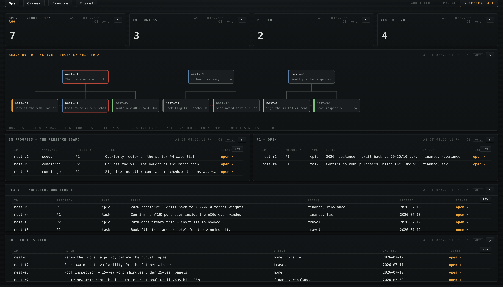
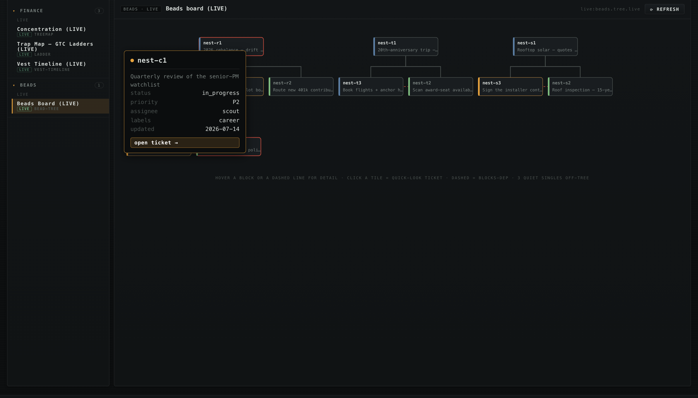
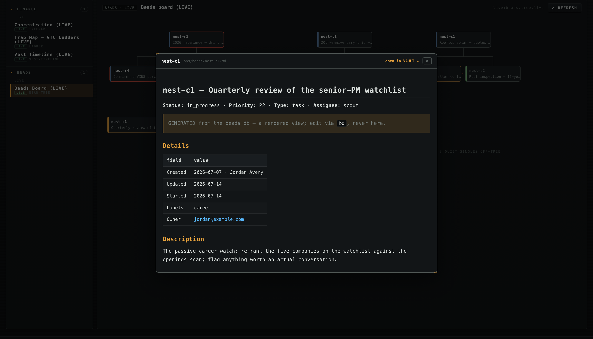

# Beads in the console — your backlog as a first-class surface

Watchman integrates [beads](https://github.com/gastownhall/beads) (`bd`) — a lightweight,
git-native issue tracker designed for humans and AI agents working the same backlog — as a
read-only console surface. If your project uses beads, the console gives you three things on top
of it: a **Backlog tab**, an interactive **dependency graph**, and per-issue **ticket pages**.
None of them require the `bd` binary at render time, and none of them can write to your tracker:
state changes always go through `bd`; the console is a glance surface.

Every bundled sample persona ships a fictional backlog, so all of this works out of the box —
load a pack and open **DASH ▸ Ops ▸ Backlog**.



## How it works

`bd` keeps its database in Dolt, but every beads workspace also maintains a **passive JSONL
export** at `.beads/issues.jsonl`. The console reads only that file:

```
bd (the source of truth) → .beads/issues.jsonl → watchman beads board --json → the console
```

Point the engine at any directory containing a `.beads/` export (the corpus root — the same
`TRACKER_PATH` the rest of the console uses) and the Backlog tab lights up. Because the export
is passive — it lags live `bd` operations until the next export — the board surfaces the file's
**age** next to the Open count. The board never performs more freshness than its source has.

```sh
watchman beads board # the board in your terminal
watchman beads board --json # the console's data contract
watchman beads tickets # render per-issue ticket pages into the vault
```

## The Backlog tab

Four stat tiles (open — with the export's age riding the title — in progress, P1 open, closed
this week) over four tables:

- **The presence board** — every `in_progress` issue with its assignee: which agent (or human)
  is on what, right now.
- **P1 — open** — the commitments.
- **Ready — unblocked, undeferred** — an honest approximation of `bd ready`: open issues whose
  blocking dependencies are all closed and whose defer date has passed. Parent-child and
  related links are navigation, not gates, and don't hold an issue back.
- **Shipped this week** — closed in the last 7 days, newest first.

Every row carries an **open ↗** link into the issue's ticket page in the VAULT.

## The beads board — the backlog as a graph

The centerpiece: active and recently-shipped issues drawn as an org chart. Epics sit above
their children (the ancestors of anything active ride along for structure, whatever their age);
standalone work shelves beneath the families; the layout **wraps to your window** and grows
down rather than scrolling sideways.

- **Status is the color signal** — in-flight amber, shipped green, deferred dim, open neutral;
  P1s carry an alert-colored accent.
- **Blocking dependencies overlay as dashed edges.** Hover one and a relationship card explains
  it — blocker and blocked side by side, with the gate's state ("active — blocker must close
  first" / "resolved — blocker closed").
- **Hover a block** for the metadata card (status, priority, assignee, labels, updated).



- **Click a tile** and the full ticket opens in a quick-look popup without leaving the graph —
  wikilinks walk to linked tickets inside the popup, and "open in VAULT" hands off to the full
  document browser with back-button support.



All three interactions, in motion:


Quiet singles (open, low-priority, standalone) stay off the graph to keep it readable — the
hint line counts them, so the trim is never silent. The same graph is browsable full-screen on
the **VIZ tab** as *Beads Board (LIVE)*.

## Ticket pages

`watchman beads tickets` renders every issue to a markdown ticket in the vault
(`ops/beads/<id>.md`): title and status chips, a details table, the description, **linked
issues in both directions as wikilinks** (parent, children, blocked-by, blocks — tickets
cross-navigate like an issue tracker's linked-issues panel), the comment thread, and the close
reason as the resolution.

The docs are a generated cache, and the generator is careful about it:

- every file carries a `GENERATED from the beads db` sentinel — **`bd` stays the source of
  truth**, and pruning only ever deletes sentinel-bearing files (a hand-written note that
  wanders into the directory is never touched);
- the sync is incremental — an mtime stamp makes an unmoved export a single stat call, and
  unchanged tickets are never rewritten;
- `watchman beads board` keeps the docs in sync implicitly, so the links on the Backlog tab
  always resolve.

## Demo fixtures that don't age

A sample backlog authored with fixed dates would drift out of the "shipped this week" window
and hollow the demo within weeks. Fixture exports may therefore carry an anchor line:

```json
{"_type": "meta", "anchor_date": "2026-07-14"}
```

Every date in the file is shifted by (today − anchor) at load time, so "closed yesterday" reads
as closed yesterday forever. Real `bd` exports never carry the line and are never shifted.

## Scope and posture

Read-only by construction. The console renders the export; it never runs `bd`, never mutates
the Dolt database, and the ticket pages are a derived view you can delete and regenerate at
any time. If you don't use beads, the tab renders a calm empty state and stays out of the way.
