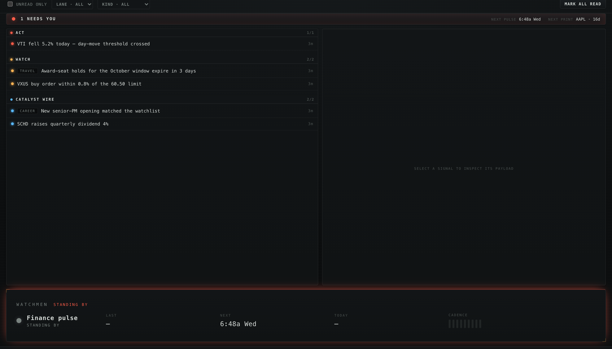

# The Harness Message Bus — producer contract (v1)

> The durable **human-event layer** between standing agents (OS-scheduled `hn` commands (cron/launchd/Task Scheduler)) and
> delivery surfaces (the Harness Bus tray app; future transports like self-hosted ntfy). Built to make
> standing-agent signals durable: transient native OS banners get missed, sleep coalesces OS-scheduled
> runs, and logs have no human surface.
> The bus fixes all three: durable unread state survives sleep; the app posts notifications under
> its own authorized identity; the inbox IS the human surface. **Zero model in the loop.**

What events become — the inbox triages by severity into ACT / WATCH / the catalyst wire, with a
payload inspector per signal:



## Storage

One SQLite database, WAL mode: **`~/.local/state/harness/bus.db`** — override with the
**`HARNESS_BUS_DB`** env var (tests point it at tmp; OSS users relocate freely). Both sides of the
contract resolve the path identically: Python (`harness.bus.store.default_db_path`) and the Rust
app. stdlib `sqlite3` / `rusqlite{bundled}`; `busy_timeout=5000` on every connection.

The bus.db lives in the harness **state dir** (`~/.local/state/harness/`), alongside the pulse
run-log. **`HARNESS_STATE_DIR`** relocates that whole dir in one knob — the isolation primitive a
sandboxed instance uses (a demo, a CI run, a second profile) so its bus **and** run-log never touch
the real ones. `HARNESS_BUS_DB` still overrides the db path specifically; `HARNESS_STATE_DIR` is the
coarse-grained seal for everything the harness writes as state.

**Concurrency model**: producers INSERT; transports/UI UPDATE `read_at` / `delivered_via`. Writers
never contend on the same columns; WAL makes the rest a non-event.

## Events schema (v1)

| column | meaning |
|---|---|
| `id` | autoincrement PK |
| `created_at` | UTC ISO-8601, written at publish |
| `producer` | who published — `finance.pulse`, `career.watch`, `manual`, `agent` |
| `lane` | harness lane for filtering/UI grouping — `finance` / `career` / `travel` / `core` / open set |
| `kind` | event kind — open set (`day_move`, `trap_proximity`, `scan_delta`, …) |
| `subject` | filterable subject (ticker, company, …); may be empty |
| `title` / `body` | notification headline / detail line |
| `payload_json` | full structured context (JSON object) — the drill-down surface; an optional `ref` deep-links the bus-app (see below) |
| `severity` | `info` \| `warn` \| `alert` (CHECK-constrained) |
| `idempotency_key` | UNIQUE — the dedup contract, see below |
| `read_at` | NULL = unread. Set by ack (app mark-read, `hn bus ack`) |
| `delivered_via` | JSON list of transport markers, see below |

`meta` table carries `schema_version` (currently `1`); future migrations key off it.

### `push_subscriptions` (additive, v1)

Web-push endpoints (the [web-push transport](#web-push--the-phone-transport)) live in the same db:

| column | meaning |
|---|---|
| `endpoint` | PK — the push service's capability URL for one browser/PWA install |
| `p256dh` / `auth` | the subscription's encryption keys (browser-generated) |
| `label` | operator-facing device label (`"iOS PWA"`, …) |
| `created_at` | UTC ISO-8601 |

Additive by construction: `CREATE TABLE IF NOT EXISTS` rides the idempotent DDL on **both** language
surfaces (Python `harness.bus.store` + the Rust app's `bus.rs` — either can boot a fresh db), but only
Python ever reads/writes it. Schema version stays `1` — no migration needed. The DDL is a
**three-surface contract**: the two DDLs and this doc must stay identical.

## Deep-links — `payload.ref`

A producer may put a **`ref`** object inside `payload_json` to make a signal *navigable*: the bus-app
Inbox renders a **"GO TO →"** button that jumps to the referenced spot. Purely additive — **no schema
change** (it rides the open `payload_json`), so any producer can adopt it and older events simply have no
button. Shape (the app's universal `Ref` descriptor):

```json
{ "ref": { "zone": "vault", "dir": "finance/research/positions/NVDA" } }
```

- `zone` (required) — `inbox | dash | surfaces | viz | vault`.
- `doc` — an exact vault-relative doc path · `dir` — a vault-relative dir, opened at its **newest** doc
  (via `list_vault_dir`) · `viz` — a `VizEntry.path` (selects that interactive diagram).
- **Existence-check producer-side** so there are no dead links (e.g. `finance.pulse` only sets `ref` for a
  symbol whose research dir exists — `events_from_pulse` stays pure; the caller does the check). Any
  producer publishing doc-anchored signals (e.g. a role-scan watcher) emits a `ref` the same way.

## Dedup — bus-side, by idempotency key

Publish is `INSERT … ON CONFLICT(idempotency_key) DO NOTHING` → result `published | duplicate`.
**Key convention**: `producer:kind:subject:YYYY-MM-DD` (local date) — derived automatically when a
draft's key is blank. This gives every producer once-per-(kind,subject)-per-day semantics by
default (the producer-side dedup the bus now supersedes). Producers needing different windows compose their own keys — the bus only enforces
uniqueness.

## `delivered_via` — transport markers

Each delivery transport appends **only its own marker** after delivering: the tray app appends
`"desktop"` after posting the native notification; a watchman in `bus_url` remote mode appends a
**per-device** marker `"desktop:{hostname}"` (each device is its own transport instance — every
device notifies exactly once, independently); a future ntfy transport appends `"ntfy"`.
Rules: a transport delivers events that are **unread AND missing its marker**; markers are never
removed; `read_at` is orthogonal (delivered ≠ read). This is what makes adding a transport purely
additive — no schema change, no producer change. Local transports write their marker directly
(rusqlite); remote transports write it via `POST /api/bus/delivered` (below).

## Producing events

- **Python (in-process)**: `BusService().publish_many(drafts)` — see `harness/finance/events.py`
  (`events_from_pulse`) for the canonical producer mapping, including the kind→severity map.
- **Any language / script**: `hn bus publish --lane X --kind Y --title T [--subject S] [--body B]
  [--severity info|warn|alert] [--payload '{"k":"v"}'|@file.json] [--producer P] [--key K]` —
  the universal on-ramp; nothing about the bus requires Python.
- Severity vocabulary: `alert` = act-worthy (trap fills, filings) · `warn` = look-soon (±5% moves)
  · `info` = awareness (calendar nearness). Encode the judgment in the producer, deterministically.

## Consuming events

- `hn bus list [--unread] [--lane X] [--kind Y] [--since ISO] [--limit N] [--json]`
- `hn bus ack <ID…> | --all [--lane X]` · `hn bus stats [--json]` · `hn bus purge --before 30d`
- MCP: `bus_list` / `bus_ack` / `bus_stats` / `bus_publish` on the unified server.
- The tray app (`bus-app/`) polls every 30s via rusqlite, posts notifications for
  undelivered unread events, marks `delivered_via`, and acks on user mark-read.

## Run-audit vs human-event (don't conflate)

`~/.local/state/harness/pulse.log` + `pulse-json.log` (both under `HARNESS_STATE_DIR` when set) remain
the **did-it-run audit** (every run,
quiet or not, plus bus publish counts: `[bus: 2 published, 1 dup]`). The bus holds only
**human-worthy events**. A quiet run writes a log line and zero bus rows.

## Serving the bus over HTTP — `hn bus serve`

The local `bus.db` contract above is complete on the machine the watchmen run on. For every OTHER
device, the always-on node serves the same bus over a small HTTP API — **centralize, don't sync**:
one authoritative db, every remote surface a client. **Purely additive**: nothing starts or
requires this server; the local-file path stays the default; sample packs never configure it (the
out-of-box demo is mesh-free by design — multi-device is an opt-in layer with its own setup doc).

- `hn bus serve [--host 127.0.0.1] [--port 8787] [--token-file ~/.config/harness/bus-token]`
- `--console` additionally mounts the **web-console RPC door** (`POST /api/invoke/{cmd}` — a
  read-only Python mirror of the native console's commands; same token), and `--ui <dist>` serves
  the console UI itself. Both off by default: the plain bus serve stays exactly what satellites
  depend on. Full form-factor doc: [`WEB-CONSOLE.md`](WEB-CONSOLE.md).
- **Auth**: every `/api/*` route requires `Authorization: Bearer <token>` (constant-time compare);
  the token auto-generates to a 0600 file on first run. `/health` is open (liveness + version only)
  so reachability probes need no secret. Transport privacy (private mesh / ACLs / TLS) is the
  deployment's responsibility — the token is defense-in-depth, not the perimeter.
- **Endpoints** (thin adapters over `BusService`; identical semantics to the CLI verbs):
  - `GET /api/bus/events?unread=1&lane=&kind=&since=&limit=` → `{"events": […]}` (newest-first)
  - `POST /api/bus/events` — body = one draft object or `{"events": [drafts…]}` →
    `{"results": [{status: published|duplicate, …}]}` — **idempotency keys dedup exactly as
    local publish does**; remote producers inherit once-per-day semantics for free
  - `POST /api/bus/ack` — `{"ids": [1,2]}` or `{"all": true, "lane"?: "finance"}` → `{"acked": N}`
  - `POST /api/bus/delivered` — `{"id": N, "marker": "desktop:winbox"}` →
    `{"id", "delivered_via"}` — a remote transport's half of the delivered_via contract
    (append-own-marker-only; idempotent; 404 on unknown id)
  - `GET /api/bus/stats` → the `BusStats` shape (remote consoles also derive unread counts and
    lane/kind filter sets from this — no dedicated meta route needed)
  - `GET /api/push/vapid-key` · `POST /api/push/subscribe` · `POST /api/push/unsubscribe` ·
    `POST /api/push/test` — the web-push transport's routes (next section)
- **TLS (optional)**: `--tls-cert PEM --tls-key PEM` (env `HARNESS_TLS_CERT`/`HARNESS_TLS_KEY`) has
  uvicorn terminate TLS directly — no reverse-proxy daemon. Both flags or neither (half a pair is a
  config error, never a silent plain-HTTP fallback). Needed off-localhost for web push (browsers
  require a secure context); deploy recipe: [`WEB-CONSOLE.md`](WEB-CONSOLE.md) → TLS.
- **Seal-honoring**: the served db resolves via `HARNESS_BUS_DB`/`HARNESS_STATE_DIR` like every
  other consumer — a sealed (demo/CI) instance serves its sealed bus, never the real one.
- **Consumers**: the watchman app's **`bus_url` remote mode** (below) and the
  [web console](WEB-CONSOLE.md). `create_app()` is a mountable Starlette app, so the web console's
  routes ride the same server — one server, one token, one bind.

### Web push — the phone transport

The served console can push **alert/warn** events to any subscribed browser/PWA (iOS 16.4+ Home-Screen
installs included) — account-free, self-hosted, no third-party relay beyond the browser vendors' push
services (which only ever see ciphertext: the Web Push protocol encrypts payloads end-to-end).

- **Hooked at publish** (`harness/bus/push.py`): after every successful non-duplicate insert, the bus
  fans the event out to all stored subscriptions. A duplicate publish never re-pushes.
- **Severity-gated, hard**: only `alert` and `warn` push. `info` (the catalyst-wire skim-stream) and
  filing kinds (`filing`, `filing_drop`, `print_landed` — mirror of the console's FILINGS band) never
  push, regardless of severity — the wire is deliberately a non-urgent surface; pushing it would drown
  the signal.
- **Best-effort by contract**: a push failure is a log line, never a failed publish. HTTP 404/410 from
  the push service prunes that subscription (the device uninstalled/revoked).
- **Keys**: a VAPID keypair generates on first use into `~/.config/harness/push-vapid-key.pem` (0600,
  honors `HARNESS_CONFIG_DIR`) — never committed, never logged, never printed. `hn bus push-keys`
  shows the PUBLIC key + the subscription inventory. `HARNESS_PUSH_CONTACT` optionally sets the VAPID
  contact claim (defaults to a non-address placeholder).
- **Payload is minimal**: title, one-line summary, lane/kind/subject/severity — never the full
  `payload_json`.
- **Subscribing**: the web console's baseplate bell (◇ PUSH) — see
  [`WEB-CONSOLE.md`](WEB-CONSOLE.md) → Push notifications. `POST /api/push/test` (or the bell's TEST
  button) verifies the pipeline end to end.

### The watchman in remote mode — connect via ⚙ Settings

**⚙ Settings → Connection → Online bus** is the way to flip a watchman from the local file to a
served bus (via the ⚙ Settings connection form): paste the served URL + the server's bearer token, **Test** (a live
probe against the served stats endpoint), **Connect**. The flow **auto-clears any active demo
pack** — the first-run footgun below can't happen on this path. **Disconnect** returns to local
mode and drops the stored token.

<details><summary>Manual fallback (older builds / headless recovery): the two config keys</summary>

Two keys in `~/.config/harness/bus-app.json` are what the Settings flow writes:

```json
{
  "bus_url": "http://bus-host.tailnet.example:8787",
  "bus_token": "<the server's ~/.config/harness/bus-token value>"
}
```

Editing by hand also requires `"active_pack": null` (see the demo-seal note below) + a restart.
</details>

- **Prefer the MagicDNS name over the tailnet IP**: the overlay IP (`100.64.0.1`) is stable across
  reboots and public-IP rotations (it's registration-bound, not DHCP), but a node delete +
  re-enroll reassigns it; the MagicDNS name follows the node. Fall back to the IP only if the
  client's MagicDNS doesn't resolve.
- Absent/blank `bus_url` = local rusqlite, unchanged — the OOTB default; no sample pack sets it.
  `bus_url` without `bus_token` is an actionable error, never a silent local fallback.
- The remote watchman runs the full local loop — Inbox, tray badge, filter chips, acks, native
  notifications — under its own per-device marker (`desktop:{hostname}`). Acks are global
  (`read_at`), so acking on one device clears badges everywhere within a poll tick (30s).
- **Demo seal trumps remote**: while a bundled demo pack is active the console renders its sealed
  local bus; a configured mesh bus never leaks into demo mode. **The Settings connect flow handles
  this automatically** (connecting clears the active pack). Only the manual-edit fallback still
  needs the explicit `"active_pack": null` — a fresh install seeds the bundled demo pack, and with
  a pack active a correct remote config is silently overridden (the footer keeps showing a local
  path).
- **Remote scope**: the served-bus mode covers the BUS surfaces — Inbox, tray badge, native
  notifications, acks. DASH/VAULT/VIZ read local contracts (spawned `hn` + local files) and render
  empty/standby on a corpus-less satellite; the full remote console is the
  [web console](WEB-CONSOLE.md) (served from the always-on node), not this mode.
- Failure shape: a dead mesh is a skipped poll tick (badge/menu keep last state) or an inline
  error in the Inbox — hard 4s/10s HTTP timeouts, never a hung UI.
