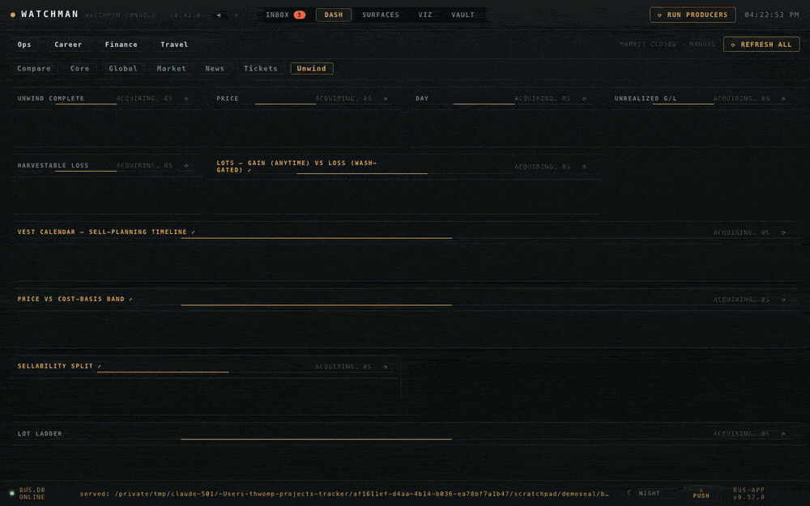
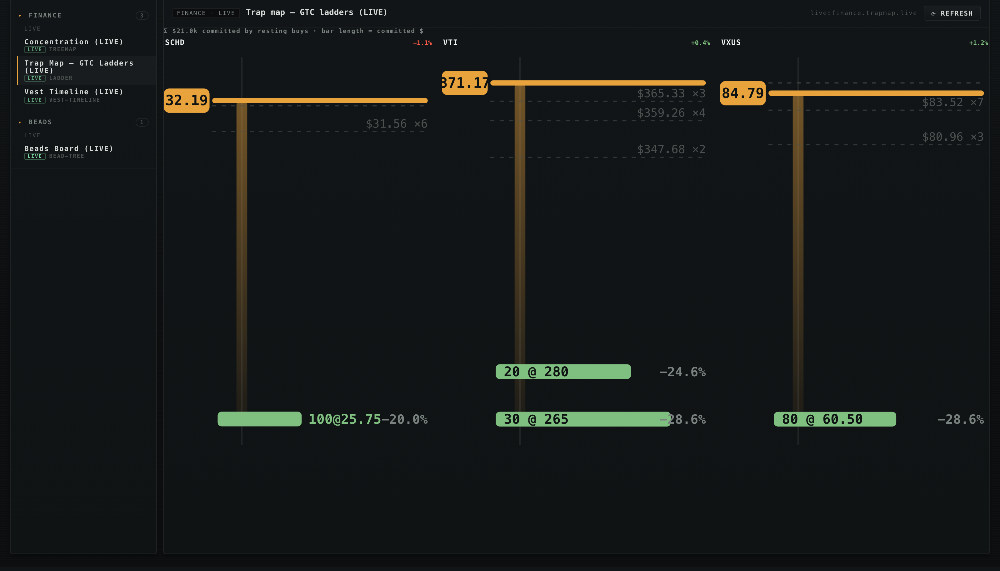
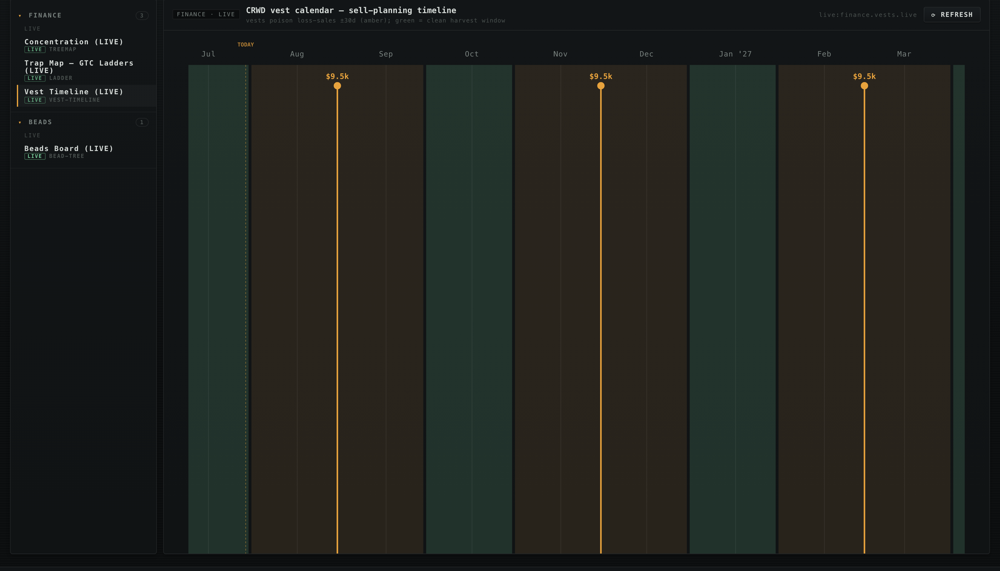
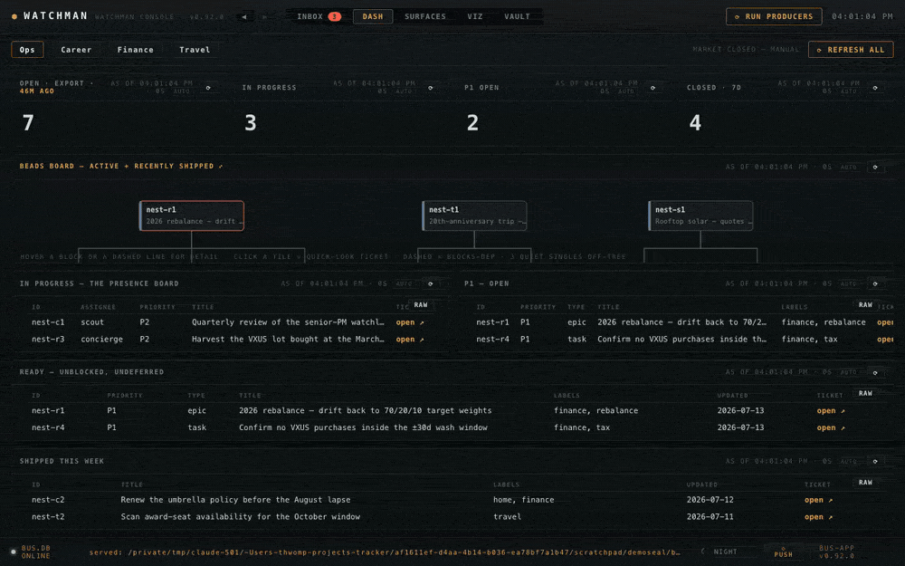
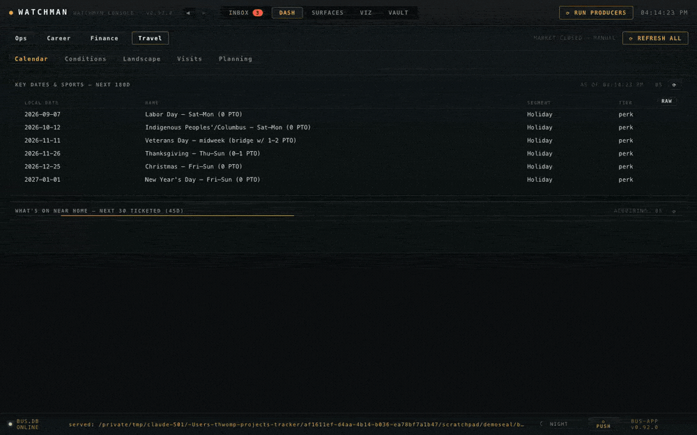
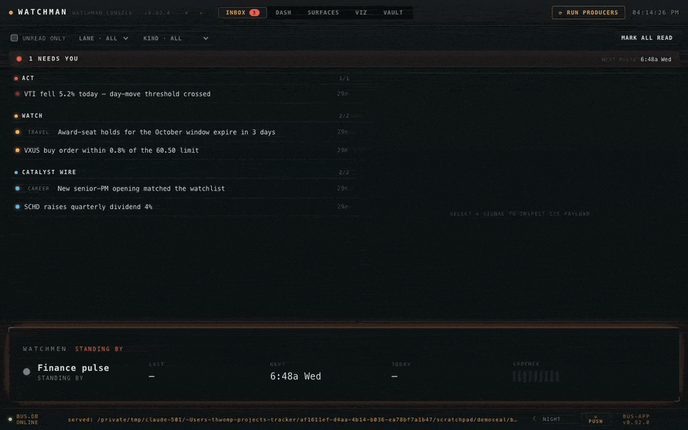
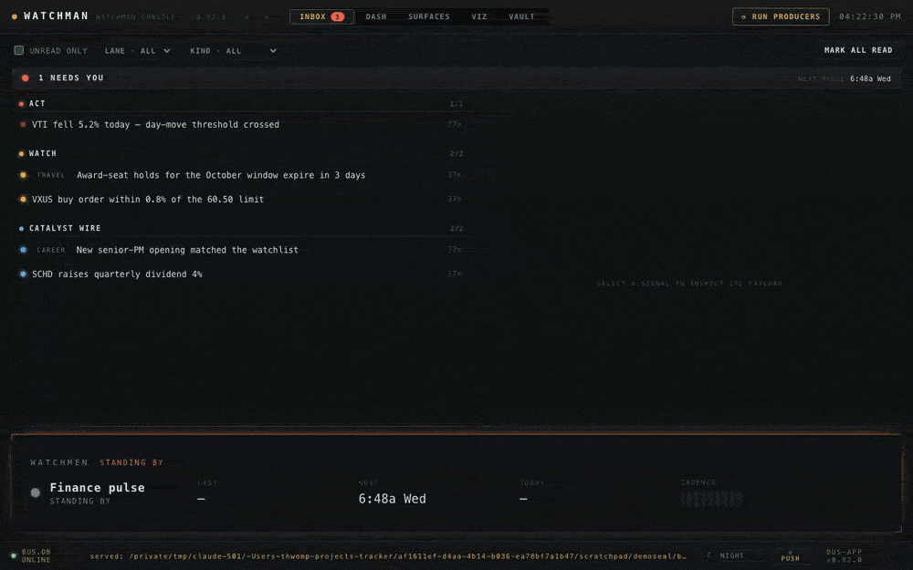
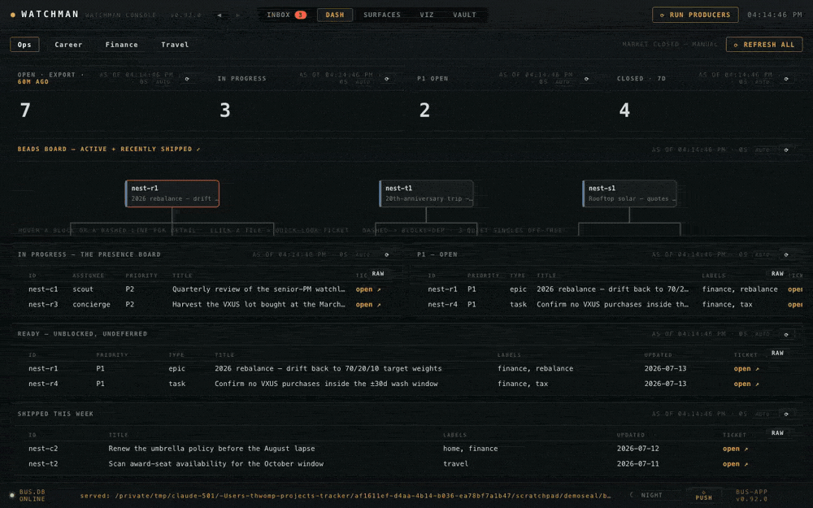

# Examples — a tour of the console

A lane-by-lane walkthrough of what Watchman actually looks like in motion. Every clip and
screenshot below was recorded **headlessly against a sealed demo instance** running the bundled
sample personas — fictional data end to end, reproducible from a fresh clone (the same
`console-tour.mjs` script that recorded them ships in `bus-app/scripts/`).

## A pack is a persona

Loading a different weight pack swaps the *whole* console — same widgets, same layouts, a
different life. Here the Finance Core view re-renders across three bundled personas (an
established index-anchored household, an early retiree on a withdrawal glidepath, and a new
grad building their base):

## The finance lane

The Finance group is a set of deterministic dashboards over the CLI's `--json` verbs — no model
in the render loop, ever. The tour: **Core** (net worth, trend, indexes, allocation) →
**Unwind** (concentrated-position sell-planning: per-lot gain/loss, the vest calendar) →
**Market** (regime and breadth) → **Tickets** (execution tickets beside the live GTC ledger):

The sell-planning view deserves a closer look — lots, wash windows, and the vest timeline in
one place:

Two of its visuals, up close. The **trap map** draws every resting GTC buy as a rung on its
symbol's price ladder — live price, distance to fill, committed dollars, support shelves from
recent history:

And the **vest timeline** — vest events sized by value, wash-sale poison windows in amber,
clean harvest windows in green:

## The backlog — beads on the console

If your project tracks work with [beads](https://github.com/gastownhall/beads), the console
renders it: counts, the presence board (which agent is on what), an honest ready queue, and the
**beads board** — the backlog as a dependency graph:

The graph is fully interactive: hover a block for its metadata card, hover a dashed edge and
the relationship explains itself (blocker and blocked, side by side), click a tile and the full
ticket opens in a quick-look popup:

The full walkthrough lives in [`BEADS.md`](BEADS.md).

## The career lane

The career board: the openings shortlist with posted comp, the application pipeline, and the
company × role-shape hiring map — fed by keyless scans:

## The travel lane

The travel command center: the trip pipeline, conditions, and the reference almanac for a
persona's home base:

## The inbox — the notification bus

Standing agents publish durable events to a local bus; the inbox triages them into **ACT**
(needs you), **WATCH**, and the **CATALYST WIRE** (a skim-stream that never drives the urgent
badge). Click a signal to inspect its payload:

## The VIZ gallery

Every visual the console renders is browsable in the big panel — live command-backed entries
(refresh on demand) alongside vault-discovered diagrams:

## The vault, and deep links everywhere

The corpus browser renders the markdown vault the agent maintains — and every surface links
into it. Here a Backlog table row jumps straight to its ticket page, and the masthead back
button returns:

## Eleven themes

Three utilitarian daily drivers (NIGHT, BRIGHT, PAPER) and a creative fleet (phosphor,
redwatch, fjord, abyss, dusk, outrun, solar, mono) — one toggle in the footer:

## On your phone

The served console installs as a PWA — the same dashboards, one column:

---

*Every asset on this page was produced by the repo's own tooling against sample data:
`hn bus serve --console` with the environment pointed at a bundled pack, driven by
`bus-app/scripts/console-tour.mjs` (video) and `console-shot.mjs` (stills), converted with the
ffmpeg/gifsicle pipeline. If you change the console, you can re-record the docs.*
