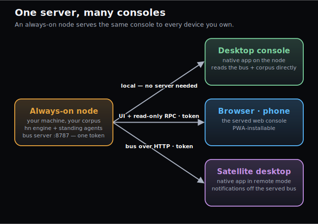
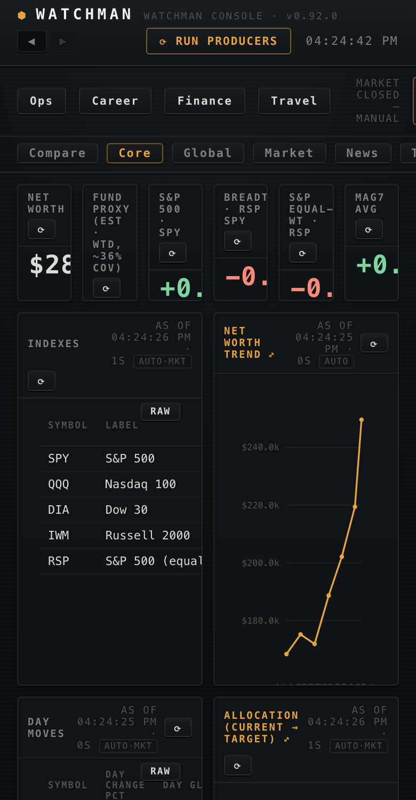

# The web console

The Watchman console in a browser. The bus server serves the **same React frontend the desktop app
embeds** — same dashboards, same inbox, same viz — over HTTP, behind the same bearer token the bus API
already uses. One server, one token, one bind: nothing new to deploy, no second service to secure.

Run it on an always-on machine over a private network or mesh (Tailscale, Headscale, a home VPN) and
every device you own has the console at one URL — including your phone.



## Serve it

Build the console once, then hand the built directory to the server:

```bash
cd bus-app && npm install && npm run build # → bus-app/dist
uv run hn bus serve --console --ui bus-app/dist
```

- `--console` mounts the RPC door the frontend talks to (`POST /api/invoke/{cmd}` — a read-only mirror
  of the desktop shell's command layer). `--ui` implies it.
- The server binds `127.0.0.1:8787` by default. To reach it from other devices, bind a private-network
  address deliberately (`--host 100.x.y.z`, or `0.0.0.0` if the network itself is trusted) — every
  `/api` route requires the token regardless of bind.
- Open `http://<host>:8787/`. The page prompts for the token on first visit and remembers it.

## The token

The bearer token auto-generates to `~/.config/harness/bus-token` (mode `0600`) the first time the
server runs. Two ways to give it to a browser:

1. **Paste it at the prompt** — the page asks once and stores it locally. This is the intended path.
2. **`?token=<value>` in the URL** — convenient for bookmarking on your own devices; the page adopts it
   and cleans the URL.

A wrong or stale token doesn't render as a broken console — the page re-prompts. The token is
defense-in-depth, not the perimeter: keep the transport private (mesh ACLs, VPN, or TLS termination in
front) and treat the bind address as the deliberate act it is.

## Phones + PWA

The console is responsive down to phone widths and ships a web-app manifest: **Add to Home Screen** on
iOS/Android installs it standalone — no browser chrome, safe-area aware, with the zone tabs along the
bottom where thumbs live. Day-to-day it reads like a native finance app pointed at your own data.



## Push notifications

The console can push **alert/warn** bus events to your devices as native notifications — the wire's
`info` skim-stream and filings deliberately never push (spec: [`BUS.md`](BUS.md) → Web push).

Arm it from the **baseplate bell** (`◇ PUSH`, bottom-right, browser/PWA only): one tap asks for
notification permission, subscribes the device, and flips to `◆ PUSH ARMED` with a **TEST** button that
round-trips a real push through the pipeline. Tap again to disarm. `hn bus push-keys` on the serving
node lists what's subscribed.

Platform notes:

- **iOS (16.4+)**: push only exists for a PWA **installed to the Home Screen** — in-browser Safari
  shows the bell dimmed with the install hint. Install (Share ▸ Add to Home Screen), open the app,
  then arm the bell.
- **Secure context required**: `localhost` counts (the flow is fully testable locally without TLS);
  any other origin — including a tailnet IP — needs HTTPS. That's what the TLS section below is for.
- Everything is account-free and self-hosted except the browser vendors' push relays
  (Apple/Google/Mozilla), which only ever carry ciphertext — payloads are end-to-end encrypted by the
  Web Push protocol, and the harness keeps them minimal regardless.

## TLS — serving HTTPS directly

`hn bus serve --tls-cert cert.pem --tls-key key.pem` (env: `HARNESS_TLS_CERT`/`HARNESS_TLS_KEY`) has
uvicorn terminate TLS itself — no reverse-proxy daemon to install, configure, and keep patched.

The intended private-mesh deploy (no port-forwarding, nothing public):

1. **A real hostname pointed at the tailnet IP**: create a subdomain at any DNS provider
   with API support for DNS-01 resolving to the serving node's overlay address (e.g. `100.64.0.1`). The name is
   public; the address it points to is only reachable inside the mesh.
2. **A real certificate via DNS-01**: mint with [lego](https://go-acme.github.io/lego/) (or any ACME
   client) using the DNS-01 challenge — it proves control of the *name*, so no inbound reachability
   is ever needed. Renewal is the same command on a timer.
3. **Serve TLS on a second port, keep `:8787` plain**: existing satellites (native watchmen in
   `bus_url` mode) keep their mesh-plain endpoint; the phone gets the secure origin push requires.

   ```bash
   hn bus serve --host 100.64.0.1 --port 8787 --console --ui bus-app/dist & # satellites, unchanged
   hn bus serve --host 100.64.0.1 --port 8788 --console --ui bus-app/dist \
     --tls-cert /path/to/console.example.crt --tls-key /path/to/console.example.key
   ```

4. On the phone, open `https://console.example.com:8788/`, install to Home Screen, arm the bell.

Both flags or neither — half a TLS pair is a config error, never a silent plain-HTTP fallback. The
token model is unchanged: TLS is transport privacy; the bearer token stays the auth.

## What it can and can't do

The web console is **read-only by construction**. The RPC door mirrors the desktop console's *read*
commands — dashboards, widgets, the inbox, the vault browser, viz — and allows exactly one write:
marking inbox events read (the same capability the bus API already carries). Switching weight packs and
running producers are desktop-console features; the door answers 403.

It also serves the corpus of the operator who launched it — the machine's real config and vault, not a
demo persona. The bundled sample personas are a desktop-console feature; to demo the *web* console
without a corpus, run it [from the container](DOCKER.md) against a scratch mount, or export
`WEIGHTS_PACK=samples/packs/demo-investor` before `hn bus serve`.

## Many consoles, one server

`--ui` repeats. A bare directory mounts the default console at `/`; `name=DIR` entries mount variants
at `/ui/<name>/`:

```bash
uv run hn bus serve --console \
  --ui bus-app/dist \
  --ui experiment=/path/to/branch-dist
```

Variant builds must be Vite-built with `--base=/ui/<name>/`. This is how you A/B a console change or
serve a phone-tuned build alongside the daily driver without touching it.

## Native satellites

A second desktop can skip the browser entirely: the **native app in remote mode** points at the same
served bus (`bus_url` + `bus_token` in its config) and delivers that machine's own notifications off it —
per-device delivery, shared read-state. See [`BUS.md`](BUS.md) → *The watchman in remote mode*.

## The pieces

| Surface | What it is |
|---|---|
| `GET /` (+ `/ui/<name>/`) | the served console build(s) |
| `POST /api/invoke/{cmd}` | the RPC door — read-only command mirror, bearer-token gated |
| `GET /api/bus/*` | the bus API the satellites use ([`BUS.md`](BUS.md)) |
| `/api/push/*` | web-push: vapid-key · subscribe · unsubscribe · test — bearer-token gated |
| `GET /health` | open liveness + version — no secret, no data |
